<!-- ============== ANIMATED HEADER ============== -->
<div align="center">
  <a href="https://github.com/codeadeel">
    
  </a>
</div>

<!-- ============== INTERACTIVE NAV ============== -->
<p align="center">
  <a href="#-whoami"></a>
  &nbsp;
  <a href="#-nvidia-smi"></a>
  &nbsp;
  <a href="#-stack"></a>
  &nbsp;
  <a href="#-stats"></a>
  &nbsp;
  <a href="#-connect"></a>
</p>

---

## 🐚 whoami

```bash
adeel@gpu-cluster:~$ whoami
adeel · machine learning engineer
> training models · shipping inference · scaling things that learn

adeel@gpu-cluster:~$ uname -a
Adeel  5.2026  #ml-engineer  SMP  x86_64  GNU/Linux   [karachi → cloud → edge]
```

## 🖥️ nvidia-smi

<div align="center">
  
</div>

## 📦 stack

```bash
adeel@gpu-cluster:~$ tree -L 2 ~/.adeel/stack

~/.adeel/stack/
├── model/
│   ├── train      →  torch · tensorflow · scikit-learn
│   ├── optimize   →  onnx · tensorrt · mxnet
│   └── explore    →  pandas · seaborn · opencv
├── infra/
│   ├── runtime    →  docker · compose · swarm · kubernetes · lxc
│   ├── pipeline   →  kubeflow
│   └── network    →  nginx · kafka · grpc
└── platform/
    ├── managed    →  gcp · aws · digitalocean · linode
    ├── metal      →  proxmox · openstack
    └── shell      →  linux · bash · git
```

## 📊 stats

`$ git log --author='adeel' --stat`

<div align="center">

<picture>
  <source media="(prefers-color-scheme: dark)" srcset="https://github-readme-stats-sigma-five.vercel.app/api?username=codeadeel&show_icons=true&hide_border=true&include_all_commits=true&bg_color=00000000&title_color=ff2d70&icon_color=ff2d70&text_color=c9d1d9"/>
  
</picture>
<picture>
  <source media="(prefers-color-scheme: dark)" srcset="https://github-readme-stats-sigma-five.vercel.app/api/top-langs/?username=codeadeel&layout=compact&hide_border=true&langs_count=8&bg_color=00000000&title_color=ff2d70&text_color=c9d1d9"/>
  
</picture>

<br/>

<picture>
  <source media="(prefers-color-scheme: dark)" srcset="https://streak-stats.demolab.com?user=codeadeel&hide_border=true&background=00000000&stroke=ff2d70&ring=ff2d70&fire=ff2d70&currStreakLabel=ff2d70&sideLabels=c9d1d9&sideNums=c9d1d9&currStreakNum=c9d1d9&dates=8b949e"/>
  
</picture>

</div>

## 📡 connect

`$ ./connect.sh --interactive`

<p align="center">
  <a href="mailto:code.adeel@gmail.com"></a>
  &nbsp;
  <a href="https://linkedin.com/in/codeadeel"></a>
  &nbsp;
  <a href="https://github.com/codeadeel"></a>
  &nbsp;
  
</p>

```bash
adeel@gpu-cluster:~$ exit
> connection closed. logs flushed. weights checkpointed.
> see you in the next epoch.
```

<div align="center">
  <sub>built with caffeine, cuda, and a deep distrust of <code>pip install --no-cache-dir</code></sub>
</div>
